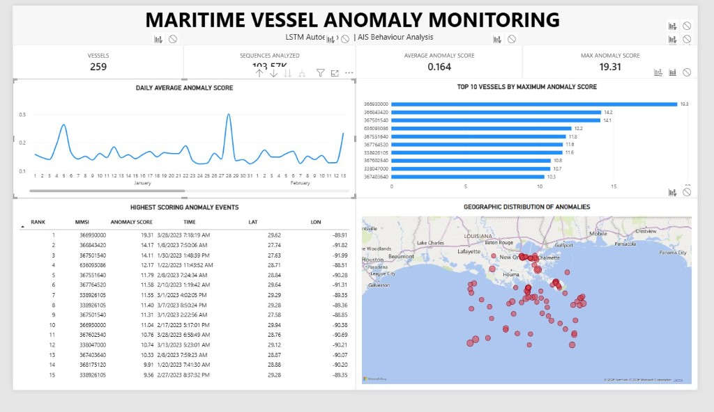

# Maritime AIS Anomaly Detection

An end-to-end analyst workflow for detecting anomalous vessel behavior in AIS (Automatic Identification System) tracking data — combining SQL-based rule detection with an unsupervised LSTM-autoencoder, validated against each other, and surfaced through a BI dashboard.

## Project Framing

Most portfolio anomaly-detection projects stop at "trained a model." This one is built as a **4-layer analyst workflow**, reflecting how this kind of finding would actually move through an organization:

1. **Data (SQL)** — clean, feature-engineer, and flag anomalies using rule-based logic
2. **Detection (Deep Learning)** — train an unsupervised LSTM-autoencoder to independently learn what "normal" vessel behavior looks like, and flag what doesn't fit
3. **BI (Power BI)** — surface the findings geographically and by severity, in a form a non-technical stakeholder can use
4. **Decision** — interpret the output: what's worth investigating first, and why

## Data

- **Source:** [2023 US Coast Guard + NOAA AIS Dataset](https://www.kaggle.com/datasets/bwandowando/2013-noaa-ais-dataset) (Kaggle), per-month Parquet files
- **Official NOAA archive:** [AIS Data for 2023](https://www.coast.noaa.gov/htdata/CMSP/AISDataHandler/2023/index.html)
- **Scope:** Gulf of Mexico bounding box (27.5–30.0°N, -92.0 to -88.5°W), January–March 2023
- **Sample:** 300 randomly sampled vessels (by MMSI) → 5,185,360 pings
- **Storage:** Loaded into PostgreSQL (`maritime_ais` database, table `ais_data`)

The monthly extracts, the 300-vessel sample, and the SQL feature export are several gigabytes combined, so they are listed in `.gitignore` and are not part of this repository. They stay in `data/` locally because the notebook and `scripts/1.py` read them from there. See [Repository layout](#repository-layout).

## Layer 1 — SQL Feature Engineering & Rule-Based Detection

Built entirely in PostgreSQL using chained CTEs (`sql/AIS_DIST_TIME_DIFF.sql`):

- Chronological per-vessel ping sequencing (`ROW_NUMBER() OVER (PARTITION BY mmsi ORDER BY base_datetime)`)
- Time-gap flagging (Short / Moderate / Long gap buckets)
- Haversine great-circle distance calculated from scratch (`RADIANS`, `SIN`, `COS`, `ATAN2`, `SQRT`, `POWER`)
- Speed cross-validation: calculated speed (distance/time) vs. self-reported SOG, flagged where they diverge significantly
- Per-vessel severity scoring: `avg_speed_diff * LN(count_of_anomalies)` — log-dampened so one high-frequency miscalibrated vessel doesn't dominate a rare-but-severe one
- Final ranking via `RANK() OVER (ORDER BY severity DESC)`

`sql/LSTM_INPUT_DATA.sql` exports the numeric features the model trains on (`mmsi`, timestamp, ping sequence, lat, lon, COG, heading, SOG, time gap, distance) without the rule-based text flags, so the LSTM cannot see the SQL labels during training.

**Key debugging findings** (documented because they materially shaped the final model):

- Stationary vessels showed GPS jitter that spiked calculated speed to physically impossible values (fixed via an `SOG > 5` filter)
- Short ping intervals amplified normal GPS positional error into false speed anomalies
- One vessel with thousands of "anomalies" by raw count turned out to be a case of consistent sensor miscalibration, not real anomalous behavior — caught by the severity-weighted ranking, missed by a raw-count ranking

## Layer 2 — LSTM-Autoencoder (Unsupervised Detection)

Trained in `notebooks/1.ipynb`:

- **Architecture:** Encoder LSTM (32 units) → bottleneck → `RepeatVector` → Decoder LSTM → `TimeDistributed(Dense)`, trained in TensorFlow/Keras
- **Input:** 50-ping sequences per vessel, 6 scaled features (lat, lon, course over ground, speed, log time gap, log distance)
- **Training:** reconstruction target is the input itself (`X, X`), Adam at learning rate `0.0001`, MSE loss, early stopping on validation loss (patience 5, up to 200 epochs, batch size 64)
- **Anomaly score:** per-sequence reconstruction error (MSE)

The saved weights are `models/ais_lstm_autoencoder.keras`. Sequence scores used by the dashboard are in `data/ais_anomaly_results.csv` (MMSI, time window, anomaly score, rank, and a representative lat/lon).

### Data quality issues found and fixed

- **`heading = 511`** — the AIS reserved code for "not available" — was present in **58% of all rows**, badly distorting feature scaling and causing training loss to diverge. Fixed by dropping `heading` from the feature set (retained `cog`, course-over-ground, as the cleaner directional signal).
- **Extreme outliers in time-gap and distance** — a handful of genuine multi-day AIS silence periods produced raw values orders of magnitude larger than typical, which is exactly the kind of signal an anomaly detector should preserve, not erase. Tried `RobustScaler` first; it didn't solve the problem since it doesn't shrink outliers, only resists being distorted by them in the typical range. Fixed with a `log1p` transform before scaling — compresses scale while preserving relative ordering, so genuine anomalies stay visible without blowing up training.

## Validation — Model vs. Rules

The LSTM was trained with no knowledge of the SQL rule-based flags. Cross-checking its output against them afterward:

- A vessel independently confirmed by the SQL layer as genuinely anchored and top-severity ranked in the **top 0.05%** of all 103,566 LSTM-scored sequences
- A vessel flagged by SQL as a likely sensor-miscalibration false positive scored near the bottom of the LSTM ranking

Two independent methods, same conclusion — this is the core validation result of the project.

## Layer 3 — BI Dashboard (Power BI)

Open `dashboard/DL project.pbix` in Power BI. The page below is **Maritime Vessel Anomaly Monitoring** (LSTM Autoencoder | AIS Behaviour Analysis).



The dashboard shows:

- Headline figures for this run: **259 vessels**, average anomaly score **0.164**, maximum anomaly score **19.31**
- Daily average anomaly score across January and February 2023
- Top 10 vessels by maximum anomaly score
- Highest-scoring anomaly events, with rank, MMSI, score, time, and lat/lon
- Geographic distribution of those anomalies across the Gulf of Mexico, clustered along the Louisiana coast

## Layer 4 — Interpretation & Limitations

- Top-ranked anomalies cluster near real operational maritime zones (e.g. Port Fourchon, the Mississippi River industrial corridor) — plausible, investigable locations rather than noise
- **Known limitation:** vessels with fewer than 50 total pings (22 of the original 300-vessel sample) cannot form a complete sequence and are excluded from LSTM detection, though they remain covered by the SQL rule-based layer
- **Known limitation:** reconstruction-error rankings vary somewhat run-to-run (e.g. the validated vessel ranked #41 in one training run and #50 in another) — the conclusion held across runs, but absolute rank should be read as approximate, not exact

## Tech Stack

- **Data:** PostgreSQL, pandas, pyarrow
- **Modeling:** TensorFlow/Keras, scikit-learn (`StandardScaler`)
- **BI:** Power BI
- **Source data:** Kaggle (2023 US Coast Guard + NOAA AIS Dataset)

## Repository layout

| Path | Role |
| --- | --- |
| `sql/meritime_ais.session.sql` | `CREATE TABLE ais_data` for the PostgreSQL load |
| `sql/AIS_DIST_TIME_DIFF.sql` | Rule-based feature engineering, anomaly flags, and severity ranking |
| `sql/LSTM_INPUT_DATA.sql` | Per-ping numeric feature query exported to `data/gulf_features.csv` |
| `notebooks/1.ipynb` | Sequence building, scaling, LSTM-autoencoder training |
| `models/ais_lstm_autoencoder.keras` | Saved model |
| `data/ais_anomaly_results.csv` | Scored sequences (included; about 12 MB) |
| `dashboard/DL project.pbix` | Power BI dashboard |
| `docs/maritime-vessel-anomaly-dashboard.jpg` | Dashboard screenshot used above |
| `scripts/1.py` | Earlier sampler: vessels with at least 50 pings, draw of 8,000, written to `data/gulf_ais_sample.csv`. The analysis above uses the separate 300-vessel Gulf sample |
| `requirements.txt` | Package versions used to build the project |

Not committed, because they exceed GitHub's 100 MB file limit:

| Local file | Approx. size | What it is |
| --- | --- | --- |
| `data/Gulf_ais_jan.csv` | 1.7 GB | January Gulf extract |
| `data/Gulf_ais_feb.csv` | 1.6 GB | February Gulf extract |
| `data/Gulf_ais_march.csv` | 1.6 GB | March Gulf extract |
| `data/gulf_ais_sample.csv` | 324 MB | Output of `scripts/1.py` |
| `data/gulf_features.csv` | 519 MB | SQL feature export read by `notebooks/1.ipynb` |
| `tf_env/` | 1.6 GB | Local virtual environment |

## Setup

PostgreSQL with a `maritime_ais` database, plus the Python packages in `requirements.txt`:

```bash
python -m venv tf_env
# Windows
tf_env\Scripts\activate
pip install -r requirements.txt
```

Rebuild path, in order:

1. Download `2023_NOAA_AIS_logs_01.parquet`, `02`, and `03` from the Kaggle dataset and filter to the Gulf bounding box above. The local monthly files are `data/Gulf_ais_jan.csv`, `data/Gulf_ais_feb.csv`, and `data/Gulf_ais_march.csv`.
2. Load the 300-vessel sample into `ais_data` using the column definitions in `sql/meritime_ais.session.sql`. Helpful indexes used during the project: `(mmsi, base_datetime)` and `(id)`.
3. Run `sql/LSTM_INPUT_DATA.sql` and export the result as `data/gulf_features.csv` (`psql \copy` was used; a GUI export was too slow at 5 million rows).
4. Run `sql/AIS_DIST_TIME_DIFF.sql` for the rule-based severity ranking.
5. Open `notebooks/1.ipynb`. It reads `gulf_features.csv` from `C:/Users/neilg/Desktop/New_folder/vs_code/ais/data/gulf_features.csv`. Training writes a model you can compare with `models/ais_lstm_autoencoder.keras`.
6. Open `dashboard/DL project.pbix` in Power BI. The scored table it presents is `data/ais_anomaly_results.csv`.

Rankings move slightly between training runs. Treat the checked-in scores and the saved `.keras` file as the run behind the dashboard.
